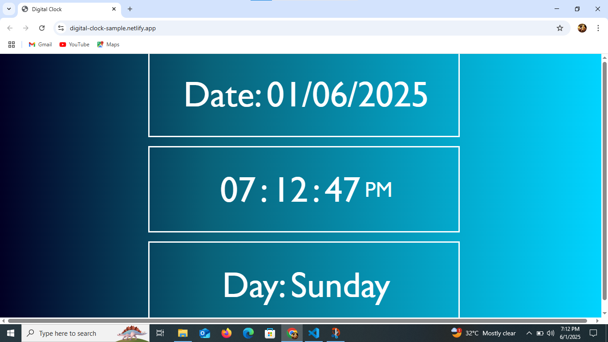

#  Digital Clock Web Application

This is a simple digital clock web application built using **HTML**, **CSS**, and **JavaScript**. It displays the current time in 12-hour format with AM/PM, the current date in `DD/MM/YYYY` format, and the day of the week.

🔗 **Live Demo**: [Click Here to Visit](https://digital-clock-sample.netlify.app/)

## Developed By
**Gayathri G**  
GitHub: [GAYATHRI1006](https://github.com/GAYATHRI1006)

## Screenshot

## Features

- Real-time clock with auto-refresh every 500ms
- Displays:
  - Hours, Minutes, and Seconds
  - AM/PM
  - Full Date (`DD/MM/YYYY`)
  - Day of the Week

## How It Works

- **HTML** provides the structure with placeholders for time, date, and day.
- **JavaScript** (`script.js`) dynamically updates these placeholders every 500 milliseconds using `setInterval`.
- **CSS** (`style.css`) styles the layout.

## Technologies Used
1. HTML5
2. CSS3
3. JavaScript
